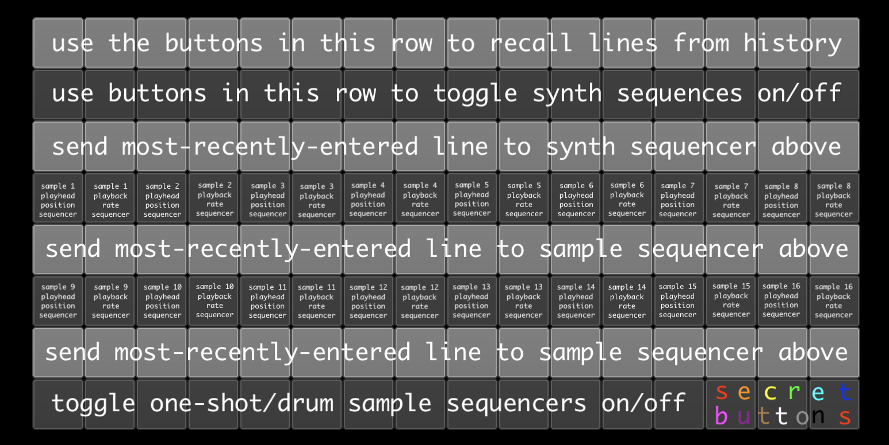

# superLied

Lied script for SuperCollider. Turns text into music.  
 
“What is a poet? A poet is an unhappy being whose heart is torn by secret sufferings, but whose lips are so strangely formed that when the sighs and the cries escape them, they sound like beautiful music.”
-Søren Kierkegaard, *Either/Or*
  
Enter text using the text field at the bottom of the screen.
  
The grid of buttons works this way: 
<b>Row 1</b>: recall lines you've typed from history 
<b>Row 2</b>: trigger synth patterns 
<b>Row 3</b>: apply the active line (either the most-recently-entered one or the one you've recalled with row 1) to the pattern immediately above 
<b>Row 4</b>: toggle sample playback and playback speed manipulation. Samples will be cut up and have their playback speed manipulated in ways determined by the active line 
<b>Row 5</b>: apply the active line (either the most-recently-entered one or the one you've recalled with row 1) to the sample cutter/speed slot immediately above 
<b>Row 6</b>: mirrors row 3 (more samplers) 
<b>Row 7</b>: mirrors row 4 (sends lines to samplers in row 6) 
<b>Row 8</b>: toggle sample playback. These samples play in their entirety and are unaffected by the active line (works nicely for drums)
 

 
<b>secret buttons</b>: the last 3 buttons in row 8 deal with input audio. The third button from the right turns audio send to Carter's Delay on or off. The second button from the right turns playback from Carter's Delay on or off. The button furthest to the right turns the clean mic signal to your audio output on or off.
  
The knobs correspond roughly to the synths and samplers on the grid. 128 knobs, 128 buttons. Play around with them. See what happens.
  
The "samples" folder should be saved in the same place as the main superLied.scd file.
  
<b>note: in order for superLied.scd to work properly, you'll need to add the 4 .sc files in the "classes" folder to your extensions folder (if you don't know where your extensions folder is, SuperCollider's IDE will show you! Just hit file > open user support directory)</b>
